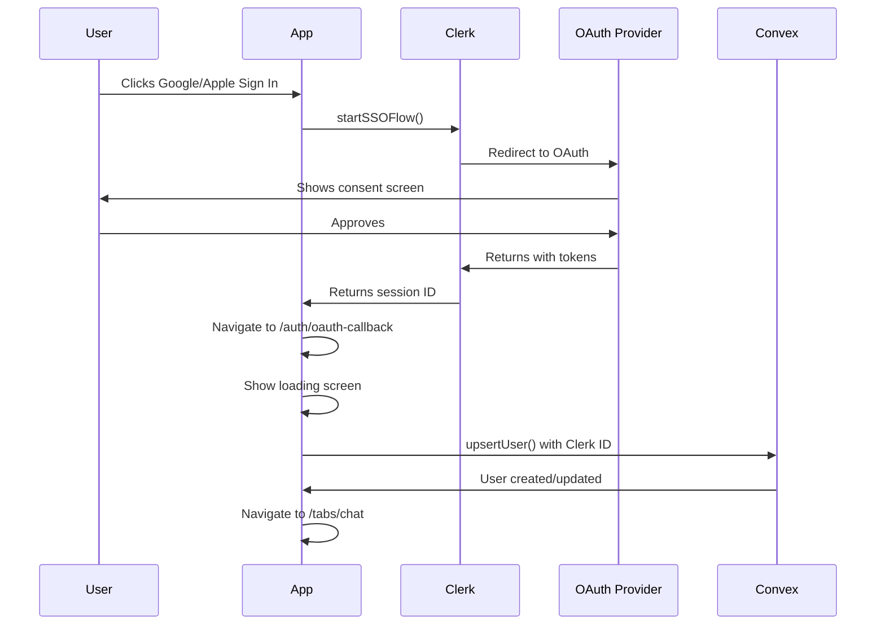

# OAuth Implementation Documentation
## Google & Apple Authentication with Clerk and Convex

### Table of Contents
1. [Overview](#overview)
2. [Architecture](#architecture)
3. [Implementation Details](#implementation-details)
4. [File Structure](#file-structure)
5. [Authentication Flow](#authentication-flow)
6. [UI/UX Design](#uiux-design)
7. [Error Handling](#error-handling)
8. [Testing Guide](#testing-guide)
9. [Troubleshooting](#troubleshooting)

---

## Overview

This document details the implementation of Google and Apple OAuth authentication in the Nafsy mental health app, using Clerk for authentication and Convex for the backend database.

### Key Features
- ✅ Google Sign-In (all platforms)
- ✅ Apple Sign-In (iOS only)
- ✅ Seamless user creation in Convex
- ✅ Professional UI with loading states
- ✅ Error prevention and handling
- ✅ Multilingual support (English/Arabic)

### Technology Stack
- **Authentication Provider**: Clerk
- **Backend Database**: Convex
- **Frontend Framework**: React Native with Expo
- **OAuth Library**: expo-auth-session
- **Styling**: Tailwind CSS (Nativewind v4)

---

## Architecture

### System Components

```
┌─────────────────┐     ┌─────────────────┐     ┌─────────────────┐
│                 │     │                 │     │                 │
│   React Native  │────▶│     Clerk       │────▶│     Convex      │
│      App        │     │  Authentication │     │    Database     │
│                 │     │                 │     │                 │
└─────────────────┘     └─────────────────┘     └─────────────────┘
        │                       │                       │
        ▼                       ▼                       ▼
  [UI Components]      [OAuth Providers]        [User Records]
  - Sign In/Up         - Google OAuth           - users table
  - OAuth Buttons      - Apple OAuth            - Indexed by clerkId
  - Loading Screen     - Session Mgmt           - Profile data
```

### Data Flow
1. User initiates OAuth flow
2. Clerk handles authentication with provider
3. Successful auth redirects to OAuth callback
4. Callback creates/updates user in Convex
5. User enters app only after database record exists

---

## Implementation Details

### 1. Social Authentication Hook
**File**: `/src/hooks/useSocialAuth.ts`

```typescript
export function useSocialAuth(): UseSocialAuthReturn {
  const { startSSOFlow } = useSSO();
  const router = useRouter();
  
  const handleSocialAuth = async (provider: SocialProvider) => {
    // Start OAuth flow
    const result = await startSSOFlow({
      strategy: provider,
      redirectUrl: AuthSession.makeRedirectUri(),
    });
    
    if (result?.createdSessionId) {
      // Set active session in Clerk
      await result.setActive?.({ session: result.createdSessionId });
      
      // Redirect to callback for user creation
      router.replace('/auth/oauth-callback');
    }
  };
  
  return { handleSocialAuth, loading };
}
```

**Key Features**:
- Handles both Google and Apple OAuth
- Browser warm-up for Android performance
- Error handling with user-friendly messages
- Haptic feedback for better UX

### 2. OAuth Callback Screen
**File**: `/src/app/auth/oauth-callback.tsx`

```typescript
export default function OAuthCallbackScreen() {
  const { user: clerkUser } = useUser();
  const upsertUser = useMutation(api.auth.upsertUser);
  
  useEffect(() => {
    const createUserAndRedirect = async () => {
      // Wait for Clerk user to be available
      if (!clerkUser?.id) return;
      
      // Check if user exists in Convex
      if (currentUser) {
        router.replace('/tabs/chat');
        return;
      }
      
      // Create user in Convex
      await upsertUser({
        clerkId: clerkUser.id,
        email: clerkUser.emailAddresses?.[0]?.emailAddress || '',
        name: clerkUser.fullName || clerkUser.firstName,
        avatarUrl: clerkUser.imageUrl,
      });
      
      // Navigate to app
      router.replace('/tabs/chat');
    };
  }, [clerkUser]);
  
  return <OAuthLoadingScreen />;
}
```

**Purpose**: Ensures user exists in Convex before app entry

### 3. UI Components

#### Social Auth Buttons
**File**: `/src/components/auth/SocialAuthButtons.tsx`

```typescript
<Button
  variant="filled"
  size="lg"
  onPress={() => handleSocialAuth('oauth_google')}
  className="flex-row items-center justify-center gap-3 rounded-xl"
>
  <GoogleIcon size={20} />
  <Text className="text-foreground text-base font-semibold">
    {t('auth.continueWithGoogle')}
  </Text>
</Button>
```

**Design Features**:
- White filled buttons with shadows
- Custom Google SVG icon with brand colors
- Apple icon using lucide-react-native
- Platform-specific rendering (Apple only on iOS)

#### Enhanced Button Component
**File**: `/src/components/ui/button.tsx`

Added new "filled" variant:
```typescript
filled: 'bg-white dark:bg-card-darker shadow-md web:hover:shadow-lg active:shadow-sm'
```

---

## File Structure

```
src/
├── app/
│   └── auth/
│       ├── sign-in.tsx          # Sign in screen with social buttons
│       ├── sign-up.tsx          # Sign up screen with social buttons
│       └── oauth-callback.tsx   # OAuth callback handler (NEW)
│
├── components/
│   └── auth/
│       ├── AppLogo.tsx          # App logo component
│       ├── AuthLayout.tsx       # Auth screens layout
│       ├── GoogleIcon.tsx       # Google brand icon
│       ├── OAuthLoadingScreen.tsx # Loading screen during setup
│       └── SocialAuthButtons.tsx  # Social auth buttons component
│
├── hooks/
│   └── useSocialAuth.ts        # OAuth flow logic
│
└── locales/
    ├── en.json                  # English translations
    └── ar.json                  # Arabic translations
```

---

## Authentication Flow

### Complete OAuth Flow Diagram



### Step-by-Step Process

1. **User Interaction**
   - User taps "Continue with Google" or "Continue with Apple"
   - Button triggers `handleSocialAuth()` function

2. **OAuth Initiation**
   - `startSSOFlow()` called with provider strategy
   - Redirect URL configured with `AuthSession.makeRedirectUri()`

3. **Provider Authentication**
   - User redirected to Google/Apple
   - User enters credentials and grants permissions
   - Provider redirects back to app

4. **Session Creation**
   - Clerk creates session with `result.setActive()`
   - Session ID stored securely

5. **User Creation Callback**
   - App navigates to `/auth/oauth-callback`
   - Loading screen shown: "Setting up your account..."
   - Clerk user data retrieved

6. **Convex Database Sync**
   - `upsertUser` mutation called with:
     - clerkId (unique identifier)
     - email
     - name
     - avatarUrl
   - User record created or updated in Convex

7. **App Entry**
   - Verification that user exists in database
   - Redirect to main app (`/tabs/chat`)
   - User can now use all app features

---

## UI/UX Design

### Visual Design Elements

#### Color System
```css
/* Auth-specific colors added to global.css */
--auth-input-bg: 250 250 250;
--auth-input-border: 229 231 235;
--auth-button-shadow: 0 0 0;
--auth-card-bg: 255 255 255;
--auth-divider: 203 213 225;
```

#### Button Styling
- **Shape**: Rounded corners (rounded-xl)
- **Shadow**: Subtle elevation for depth
- **Icons**: Official brand colors for Google, monochrome for Apple
- **Typography**: Semi-bold, 16px font size

#### Loading Screen
- App logo centered
- Activity spinner
- "Setting up your account..." message
- "This will only take a moment" subtext

### Responsive Layout
```typescript
<View className="max-w-sm w-full mx-auto">
  {/* Ensures proper width on all screen sizes */}
</View>
```

---

## Error Handling

### Common Scenarios

1. **User Cancels OAuth**
   - No error shown
   - User returns to sign-in screen
   - Can retry immediately

2. **Network Issues**
   ```typescript
   if (error?.message) {
     Alert.alert(t('common.error'), errorMessage);
   }
   ```

3. **Convex User Creation Fails**
   - Still allows app entry
   - AppLayout component retries creation
   - Prevents blocking user access

4. **Clerk Session Issues**
   - Automatic retry with exponential backoff
   - Maximum 10 retry attempts
   - Falls back to sign-in screen

### Error Prevention Strategies

1. **Loading States**
   - Prevents double-clicking
   - Shows progress to user
   - Disables buttons during processing

2. **User Existence Check**
   ```typescript
   if (currentUser) {
     router.replace('/tabs/chat');
     return; // Skip creation if user exists
   }
   ```

3. **Timeout Handling**
   ```typescript
   if (retryCount < 10) {
     setTimeout(() => setRetryCount(prev => prev + 1), 500);
   }
   ```

---

## Testing Guide

### Prerequisites
1. Clerk dashboard configured with:
   - Google OAuth credentials
   - Apple OAuth credentials (iOS only)
   - Proper redirect URLs

2. Environment variables set:
   ```env
   EXPO_PUBLIC_CLERK_PUBLISHABLE_KEY=pk_test_...
   EXPO_PUBLIC_CONVEX_URL=https://...convex.cloud
   ```

### Test Scenarios

#### Scenario 1: New User Sign-Up
1. Tap "Continue with Google"
2. Complete Google authentication
3. Verify loading screen appears
4. Confirm redirect to chat screen
5. Check Convex database for user record

#### Scenario 2: Existing User Sign-In
1. Sign out of app
2. Tap "Continue with Google"
3. Automatic authentication (if still logged in to Google)
4. Verify immediate redirect (no user creation)

#### Scenario 3: Network Interruption
1. Start OAuth flow
2. Disable network mid-process
3. Verify error message appears
4. Re-enable network and retry

#### Scenario 4: Apple Sign-In (iOS only)
1. Verify Apple button only shows on iOS
2. Complete Apple authentication
3. Verify same flow as Google

### Development Testing
```bash
# Start development server
bun start

# Run on iOS simulator
bun ios

# Run on Android emulator
bun android

# Check Convex logs
bun convex:dev
```

---

## Troubleshooting

### Common Issues and Solutions

#### Issue: "User not found" errors in Convex
**Solution**: Ensure OAuth callback screen is used
```typescript
// Correct
router.replace('/auth/oauth-callback');

// Incorrect (old implementation)
router.replace('/tabs/chat');
```

#### Issue: OAuth buttons not responding
**Solution**: Check loading state
```typescript
if (loading) return; // Prevents multiple clicks
```

#### Issue: Apple Sign-In not showing
**Solution**: Verify platform check
```typescript
{Platform.OS === 'ios' && (
  <AppleSignInButton />
)}
```

#### Issue: User data not syncing
**Solution**: Verify upsertUser mutation
```typescript
await upsertUser({
  clerkId: clerkUser.id, // Required
  email: clerkUser.emailAddresses?.[0]?.emailAddress || '',
  name: clerkUser.fullName || clerkUser.firstName,
  avatarUrl: clerkUser.imageUrl,
});
```

### Debug Logging
Enable in development:
```typescript
if (__DEV__) {
  console.log('OAuth result:', result);
  console.log('Clerk user:', clerkUser);
  console.log('Convex user:', currentUser);
}
```

### Convex Dashboard
Monitor user creation:
1. Go to Convex dashboard
2. Navigate to Data → users table
3. Check for new records with clerkId

---

## Best Practices

1. **Always use the OAuth callback screen** for user creation
2. **Show loading states** during async operations
3. **Handle errors gracefully** without blocking user
4. **Test on real devices** for accurate OAuth behavior
5. **Keep translations updated** for both languages
6. **Monitor Convex logs** for database issues
7. **Use platform-specific features** appropriately

---

## Security Considerations

1. **Never expose API keys** in client code
2. **Use environment variables** for sensitive data
3. **Validate user data** before database operations
4. **Implement rate limiting** for auth attempts
5. **Use HTTPS** for all network requests
6. **Keep dependencies updated** for security patches

---

## Future Enhancements

1. **Additional Providers**
   - Facebook OAuth
   - Twitter/X OAuth
   - Microsoft OAuth

2. **Enhanced Features**
   - Remember me functionality
   - Biometric authentication after OAuth
   - Account linking (multiple providers)

3. **Analytics**
   - Track authentication methods
   - Monitor success/failure rates
   - User preference analysis

---

## Conclusion

The OAuth implementation provides a secure, user-friendly authentication experience that seamlessly integrates Clerk's authentication with Convex's database. The architecture ensures data consistency while providing excellent UX through proper loading states and error handling.

For questions or issues, please refer to:
- [Clerk Documentation](https://clerk.dev/docs)
- [Convex Documentation](https://docs.convex.dev)
- [Expo Auth Session](https://docs.expo.dev/versions/latest/sdk/auth-session/)

---

*Last Updated: January 2025*
*Implementation by: Claude Code Assistant*